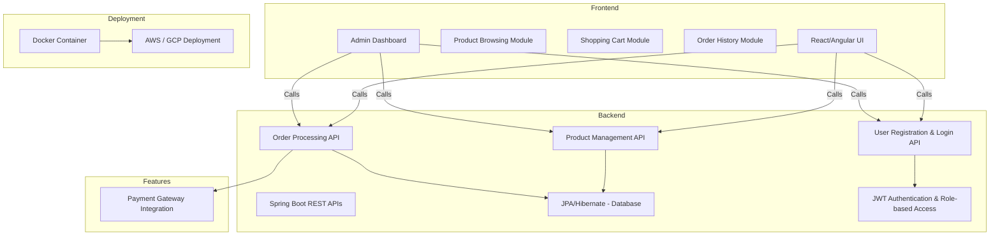

# QuickShop
Build a complete e-commerce application with user authentication, product catalog, order management, and payment integration.

Backend:
Use Spring Boot to build REST APIs for user registration, login, product management, and order processing.
Implement JWT-based authentication and role-based access control.
Use JPA/Hibernate for database interaction.

Frontend:
Use React or Angular for a responsive front-end interface.
Create modules for browsing products, shopping cart, and order history.

Features:
Admin dashboard for managing products, orders, and users.
Payment gateway integration (e.g., PayPal or Stripe).
Deployment: Dockerize and deploy to AWS/GCP.

